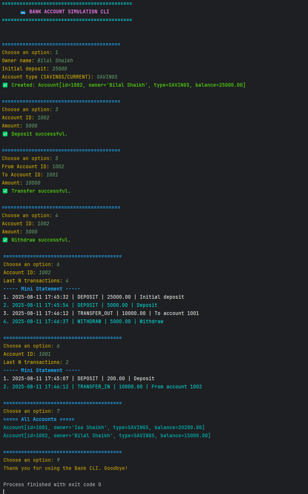

Here's a professional, copy-paste-ready `README.md` for your project.

````markdown
# 💳 Bank Account Simulation CLI

A console-based banking application built with **Java** that demonstrates **Object-Oriented Programming (OOP)**, **Java Collections**, and **Exception Handling**. The application provides essential banking operations through an interactive, menu-driven Command-Line Interface (CLI).

---

## ✨ Features

- Create Savings and Current accounts
- Deposit and withdraw funds
- Transfer money between accounts
- View account details and balance
- Generate mini statements with transaction history
- Apply interest to savings accounts
- List all accounts
- Input validation and exception handling
- ANSI color-based command-line interface

---

## 🛠️ Tech Stack

- Java
- Object-Oriented Programming (OOP)
- Java Collections Framework
- Exception Handling

---

## 📂 Project Structure

```text
Bank-Account-CLI/
├── README.md
├── .gitignore
├── images/
│   └── output.png
├── src/
│   ├── Main.java
│   ├── ConsoleColors.java
│   ├── model/
│   │   ├── Account.java
│   │   └── Transaction.java
│   └── service/
│       └── Bank.java
```

---

## 🚀 How to Run

### Clone the repository

```bash
git clone https://github.com/anshsharma-09/bank-account-simulation-cli.git
```

### Navigate to the project

```bash
cd bank-account-simulation-cli
```

### Compile the project

```bash
javac src/**/*.java
```

### Run the application

```bash
java src.Main
```

> Alternatively, open the project in **IntelliJ IDEA** or **VS Code** and run `Main.java`.

---

## 📋 Sample Menu

```text
=========== BANK MENU ===========
1. Create Account
2. View Account
3. Deposit
4. Withdraw
5. Transfer
6. Mini-Statement
7. List All Accounts
8. Apply Interest
9. Exit
```

---

## 📸 Sample Output



---

## 📚 Concepts Used

- Classes and Objects
- Encapsulation
- Inheritance
- Java Collections
- Exception Handling
- File Organization
- Menu-driven Programming

---

## 🔮 Future Improvements

- Database integration (MySQL)
- User authentication
- Persistent data storage
- Transaction search and filters
- GUI version using JavaFX or Swing

---

## 👨‍💻 Author

**Ansh Sharma**

GitHub: https://github.com/anshsharma-09